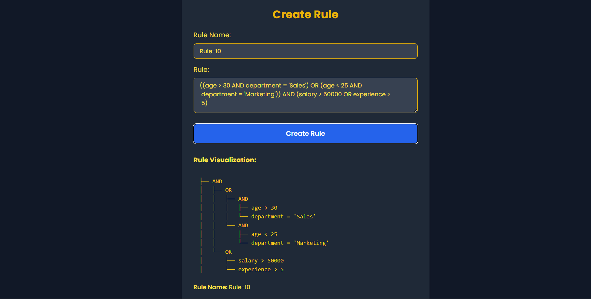

# Application 1: Rule Engine using AST 
Preview: 

## Overview

This application functions as a rule engine that assesses user eligibility based on various attributes, including age, department, salary, and experience. It employs an Abstract Syntax Tree (AST) for representing and managing conditional rules, facilitating the dynamic creation, combination, and evaluation of rules.

## Features

- **Rule Creation:** Users can define rules using a string format, which is then transformed into an AST.

 

- **Rule Combination:** Allows the merging of multiple rules into a singular AST to enable more intricate evaluations.


- **Rule Evaluation:** Assesses whether the provided data aligns with the criteria set by the AST.


- **Tree Visualization:** When defining or combining rules, a tree representation will be displayed for better understanding.

- **Display Rule:** It display all the rule created along with tree.


## Tech Stack

- **Backend:** Built with Node.js and Express.js
- **Database:** Utilizes MongoDB

## Getting Started

### Prerequisites

- Ensure Node.js and npm are installed.

### Installation Steps

1. **Clone the Repository**
   ```bash
   git clone "https://github.com/rampalyadav0001/Rule_Engine_with_AST.git"
   ```
2. **Install the Backend Dependencies**
   ```bash
   npm install
   ```
2. **Create a .env file and add ur Mongo_url**
   ```bash
   MONGO_URL=""
   ```
4. **Launch the Server**
   ```bash
   npm start
   ```

## API Endpoints

1. **Create a Rule**
   - **Endpoint:** `/api/create_rule`
   - **Method:** POST
   - **Request Body:**
     ```json
     {
       "ruleString": "((age > 30 AND department = 'Sales') OR (age < 25 AND department = 'Marketing')) AND (salary > 50000 OR experience > 5)",
       "ruleName": "Rule-1"
     }
     ```
   - **Note:** Ensure that there are appropriate spaces in the rule for accurate results. The rule should follow this format: 
   `variable operator value`
   - **Response:**
   
   
     
     
2. **Combine Rules**
   - **Endpoint:** `/api/rules/combine_rules`
   - **Method:** POST
   - **Request Body:**
   - **Response:**
   


3. **Evaluate a Rule**
   - **Endpoint:** `/api/rules/evaluate_rule`
   - **Method:** POST
   - **Request Body:**
     ```json
     {
       "rule": { ... },
       "data": {
         "age": 35,
         "department": "Sales",
         "salary": 60000,
         "experience": 3
       }
     }
     ```
   - **Response:**
     ```json
     {
       "result": true
     }
     ```

## Running Tests

You can implement and execute tests to verify that everything is functioning as expected.
